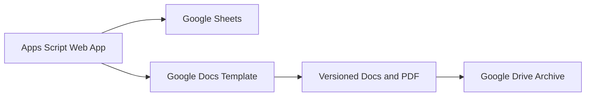

# ProcureFlow — Indonesian Government Procurement Workflow

ProcureFlow is a portfolio version of an internal procurement-administration workflow built with Google Apps Script, Google Sheets, Google Docs, and Google Drive. It provides a single web interface for package entry, budget allocation, document generation, and versioned archives.

It was designed to show how a spreadsheet-based administrative process can be transformed into a secure, user-friendly web application while retaining familiar Google Workspace tools as the data and document layer.

> Privacy notice: this repository contains source code and fully fictional preview data only. It intentionally excludes real spreadsheets, document templates, deployment URLs, asset IDs, employee/vendor records, budget details, letters, PDFs, and office screenshots.

## Highlights

- Responsive dashboard for package, budget, status, vendor, and team summaries.
- Guided package form for identity, values, dates, items, budget allocations, and letters.
- Search over active budget lines.
- Automated Google Docs and PDF generation with versioned Drive archives.
- Indonesian rupiah and terbilang formatting.
- Repeating detail-table headers in generated Google Docs.
- Server-side user allowlist using email addresses or a Google Workspace domain.
- Script Properties for organization-specific values and Google asset IDs.

## Architecture



## Repository files

- `PPBJ_Automation.gs` — spreadsheet menu, validation, budget revision, merge data, and document generation.
- `PPBJ_Web.gs` — authenticated web-app server functions.
- `Index.html` — responsive single-page interface with fictional offline preview data.
- `appsscript.json` — Apps Script manifest and explicit OAuth scopes.
- `scripts/` — local/CI checks for syntax and sensitive data.
- `docs/security-review.md` — threat model, implemented controls, and residual deployment requirements.

## Secure setup

1. Create a Google Spreadsheet using the expected sheet and column structure.
2. Open **Extensions → Apps Script** and add the files in this repository.
3. In **Project Settings → Script Properties**, add:

| Property | Required | Example |
|---|---:|---|
| `SPREADSHEET_ID` | Yes for standalone scripts | `your-spreadsheet-id` |
| `ORGANIZATION_NAME` | Yes | `Example Organization` |
| `ORGANIZATION_ADDRESS` | Yes | `Example address` |
| `DIPA_REFERENCE` | Optional | `Budget reference` |
| `ALLOWED_DOMAIN` | One access rule required | `example.go.id` |
| `ALLOWED_EMAILS` | One access rule required | `admin@example.com,user@example.com` |

4. Deploy as a web app:
   - **Execute as:** User accessing the web app.
   - **Who has access:** only the intended account or Workspace organization.
   - Do not deploy as anonymous/public when connected to operational data.
5. Run `setupSystem()` once from the Apps Script editor, then refresh the spreadsheet.

### Avoid duplicate global declarations

Google Apps Script evaluates all `.gs` files in a single global namespace. Keep
`const CFG` only in `PPBJ_Automation.gs`; do not copy that configuration block
into `PPBJ_Web.gs`. When replacing a file in the editor, select all of the old
contents first so the new source is not appended to an existing copy.

## Privacy safeguards used in this portfolio version

- Google asset IDs are read from Script Properties, never committed.
- The web app denies access if no allowlist is configured.
- Every callable data function checks the active user's identity.
- Cross-origin framing is not enabled.
- Google Docs/Drive links are restricted to HTTPS allowlisted hosts in the browser UI.
- Hyperlink labels are resolved to their real Google Docs/Drive targets before being returned to the browser.
- Empty placeholders and blank table cells are handled without inserting invalid empty text elements into Google Docs.
- Demo records use fictional names, codes, dates, and amounts.
- `.gitignore` blocks common local credentials, exports, office documents, and deployment files.

## Checks

Run before each commit:

```bash
node scripts/check-syntax.mjs
node scripts/check-sensitive-data.mjs
node scripts/check-links.mjs
node scripts/check-document-generation.mjs
```

## Working with ChatGPT/Codex

This repository can be maintained through ChatGPT's GitHub connector without sharing a password or personal access token in chat:

1. Connect the GitHub app in ChatGPT settings and grant access only to the intended repository.
2. Select the GitHub connector when starting a coding request.
3. Provide the repository URL and describe the required change.
4. Review the files, commit, and security-check results reported by Codex.

The connector does not continuously synchronize unrelated local edits. Each future code update should explicitly request that the sanitized portfolio copy be updated in this repository.

## Suggested GitHub About

> Privacy-safe portfolio of an Indonesian public-sector procurement workflow built with Google Apps Script, Sheets, Docs, and Drive.

Suggested topics: `google-apps-script`, `procurement`, `indonesia`, `google-sheets`, `google-docs`, `automation`, `portfolio`.

## Author

Nabilla Fathasya Arom — statistician and public-sector digital workflow enthusiast.

This repository demonstrates software design and automation skills. It is not an official system or publication of any government institution.
